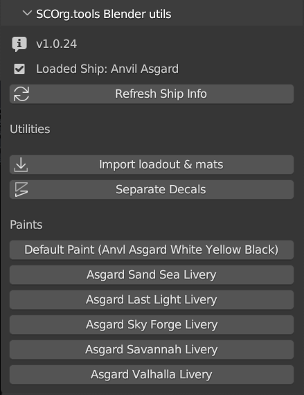
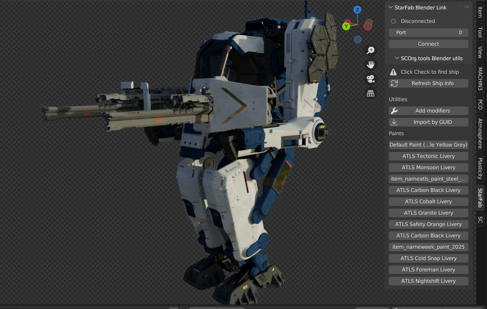

# Blender-Tools

The **SCOrg.tools Blender addon** is a specialized asset management system designed for importing and manipulating Star Citizen game assets within Blender as a companion to StarFab.  
This addon extends the functionality of the StarFab Blender addon by providing advanced import capabilities for complex 3D assemblies, hierarchical component systems, and paint management from Star Citizen's `Data.p4k` archives.

---

## Installation

1. Download the latest .zip file release from [GitHub Releases](https://github.com/scorg-tools/Blender-Tools/releases) (under the assets section).
2. In Blender, go to **Edit → Preferences → Add-ons → Install** and select the `.zip` file.
3. In the same section, fill in the preferences:
    - Select your `Data.p4k` (either live, PTU, or a historical version you may have backed up).
    - Fill in the extract directory.

   

4. Go to the 3D viewport, press `N` to open the panels on the right, go to **StarFab** to find the user interface.
5. Click on **Load Data.p4k**.

   

6. ⏳ *Wait 20-30 seconds for it to load the game data.*

### To fix things after importing a blueprint from StarFab:

1. Import as usual using StarFab's blueprints.
  
2. Click **Make Instance Real**.
3. ⏳ *Wait some more time (the more complex the ship the longer this takes).*
4. Click **Refresh Ship Info - Don't see it? Then click Load Data.p4k**.
5. Click **Import Missing Loadout**.

<table>
  <tr>
    <td valign="top">
      
    </td>
    <td rowspan="2" valign="top">
      
    </td>
  </tr>
  <tr>
    <td valign="top">
      
    </td>
  </tr>
</table>

6. Some time later...
7. Rejoice!

  
8. Try changing the paint:
 

---

## To Import a Specific Item

1. Click **Import by GUID**.
2. In StarFab, search for the item:
    - Go to **Data → Datacore** and search for the name or part of the name.
    - Look through the list, find what you want, double-click it, and copy the GUID.
3. Extract the directory with all the bits you need for this particular item in **Data → Data.p4k**.

     

4. In Blender, click **Import By GUID**, paste the GUID.

      

5. ⏳ *Wait.*
6. Rejoice once more!

      
---

## FAQ

**Q: Why does yours have all the materials?**  
A: Because I extracted all the `.mtl` files (In StarFab go to **Data → Data.p4k**, search for `.mtl`, hit enter, wait a while, extract the whole lot).  
If you see messages in the Blender Console about missing `.dae` files, `.mtl` files, or textures when the materials load, make sure you extract everything that is missing and try again.

**Q: Why does yours look prettier than mine?**  
A: Because I have it in rendered preview (top right of the viewport) and use Cycles for raytracing.  
Also, I use one of the built-in HDRIs for lighting in the World shader (find the files in your Blender install dir: `3.6\datafiles\studiolights\world\` or download ones online, e.g. [Poly Haven](https://polyhaven.com/hdris)).
  